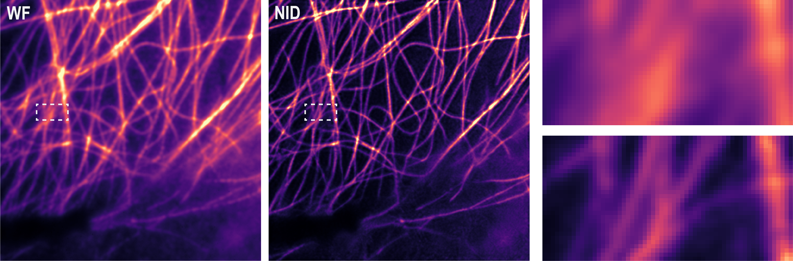

# Neural Inverse Diffraction for Far-Field Fluorescence Super-Resolution microscopy

Rather than directly inverting the propagation operator or learning a structure-specific image mapping, NID learns propagation-constrained inverse-diffraction dynamics under an explicit forward-propagation model, yielding a physically interpretable and stable reconstruction trajectory.

## Contents

- [Physics-driven Neural Network-based Inverse Diffraction for Super-resolution Optical Microscopy](#physics-driven-neural-network-based-inverse-diffraction-for-super-resolution-optical-microscopy)
	- [Contents](#contents)
	- [Environments](#environments)
	- [File Structure](#file-structure)
	- [How to train a model](#how-to-train-a-model)
		- [Data Preparation](#data-preparation)
		- [Training](#training)
	- [Use our pretrained model for inference](#use-our-pretrained-model-for-inference)
	- [License](#license)
	- [Citation](#citation)

## Environments

- Ubuntu 20.04
- CUDA 11.7
- cudnn 8.5.0
- Python 3.9.21
- PyTorch 1.13.1+cu117
- Torchvision 0.14.1+cu117
- GPU memory: <2 GB for inference, ~30 GB for training

## File Structure

```text
neural-inverse-diffraction
├── configs
│   ├── SIM
│   │   └── default_configs.py          // default experiment and optical settings for SIM
│   ├── STED 
│   │   └── default_configs.py          
│   └── SMLM
│       └── default_configs.py 
├── data                                // dataset for training and inference (gitignored)
├── model_code
│   ├── unet.py                         // main U-Net backbone
│   ├── nn.py                           // neural network building blocks
│   ├── ema.py                          // exponential moving average utilities
│   ├── utils.py                        // model-side helper functions
│   └── __init__.py
├── scripts
│   ├── datasets.py                     // dataset loading and preprocessing helpers
│   ├── losses.py                       // physics/optimization loss definitions
│   ├── reconstruction.py               // reconstruction pipeline helpers
│   └── utils.py                        // training/inference utility functions
├── runs                                // folder for checkpoints and results (gitignored)
├── train.py                            // training entry script
├── predict.py                          // reconstruction/inference entry script
├── requirements.txt                    // python dependencies
├── README.md
└── License
```

## How to train a model

### Data Preparation

Prepare your dataset under `data/`, and make sure it is compatible with `scripts/datasets.py`.

### Training

After **preparing** the data and **checking** the config file, **train** the model with:

```bash
python train.py --config configs/SIM/default_configs.py
```

Model checkpoints and intermediate outputs are typically saved to `runs/`.

## Use our pretrained model for inference

Run `predict.py` for reconstruction with the provided pretrained checkpoint and sample images:

```bash
python predict.py \
	--config configs/SIM/default_configs.py \
	--workdir runs/SIM_WF/ \
	--checkpoint 0 \
	--data_dir data/BioSR/val_input/small_test \
	--batch_size 1 \
	--n_candidates 1
```

Expected inputs available in this repository:

- Example images: `data/BioSR/val_input/small_test/MT.tif` (and other files in the same folder)
- Pretrained checkpoint: download from [releases](https://github.com/XuLabZJU/neural-inverse-diffraction/releases) and save to `runs/SIM_WF/checkpoints-meta/checkpoint.pth`

Typical outputs:



## License

This project is released under the license provided in `LICENSE`

## Citation

If you find this codebase useful for your research, please cite our paper. The citation details will be updated upon publication.

```bibtex
@article{anonymous_nid_2026,
  title={Neural Inverse Diffraction for Far-Field Fluorescence Super-Resolution microscopy},
  author={Anonymous Authors},
  journal={Under Review},
  year={2026}
}
```
